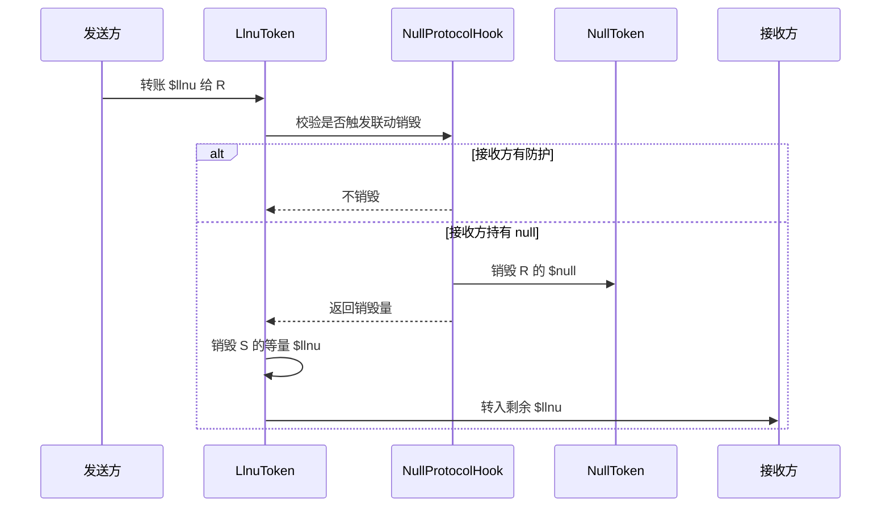

# null / llnu 协议指南

> `$null` 可在 DEX 交易；`$llnu` 的 P2P 转账会按规则销毁接收方持有的等量 `$null`。

---

## 一、概述

**null / llnu** 是部署在以太坊上的双代币协议：

| 代币 | 定位 | 主要用途 |
|------|------|----------|
| **$null** | 主代币 | ETH 铸造、Uniswap v4 交易、质押、购买防护 |
| **$llnu** | 配对代币 | 仅支持 P2P 转账；无 DEX 池；转账时可触发 `$null` 销毁 |

基本流程：

1. 用 ETH 铸造 `$null`，同时 **1:1** 获得 `$llnu`
2. `$null` 募集满额后，协议自动在 Uniswap v4 创建 ETH / `$null` 流动性
3. 向他人转账 `$llnu` 时，若对方未开启防护且持有 `$null`，会按 1:1 销毁对方钱包中的 `$null`（对方无需签名）

该行为与常见 ERC-20 预期不同。持有代币即表示接受上述链上规则。

---

## 二、联动销毁机制

### 2.1 触发条件

- **会触发**：`$llnu` 的钱包间 P2P 转账
- **不会触发**：`$null` 的普通转账

示例：A 向 B 转账 **100 $llnu**，B 当前持有 **60 $null**：

1. 检查 B 是否处于防护状态 → 是则跳过销毁
2. 销毁量 = min(100, 60) = 60
3. 销毁 B 的 60 $null（无需 B 授权）
4. 销毁 A 的 60 $llnu
5. B 收到剩余 40 $llnu

要点：

- **被动销毁**：接收方未主动授权，其 `$null` 仍可能被销毁
- **1:1 上限**：销毁量不超过 `min(转账量, 接收方 $null 余额)`
- **无 $null 则不销毁**：接收方 `$null` 余额为 0 时，转账正常完成

### 2.2 签名与权限

| 需要你的签名 | 不需要你的签名 |
|--------------|----------------|
| 转出 `$null` / `$llnu` | 收到他人的 `$llnu` |
| DEX 上 swap `$null` | 联动销毁中被动的 `$null` 销毁 |
| 质押、购买防护卡 | 协议规则触发的被动 `$null` 销毁 |

### 2.3 豁免路径

以下场景下，`$llnu` 转账 **不** 触发联动销毁：

1. 与 **NullProtocolHook** 合约交互（$null 质押进出）
2. 与 **Uniswap v4 PoolManager** 交互——对 `$llnu` 会直接 revert（禁止入池）

---

## 三、防护

持有 `$null` 且希望避免被他人转账 `$llnu` 触发销毁，可使用以下方式：

### 3.1 质押

仅 **$null** 可转入协议 Hook 合约质押并获得防护；**$llnu 无法质押**。质押期间针对该地址的联动销毁不执行。取回质押后，若无防护卡则失去防护。

**官网质押入口暂未开放**，请使用 Shield 防护卡。

### 3.2 防护卡

销毁固定数量的 `$null`（发送至 `0x…dEaD`）购买时限防护，数量不随币价浮动：

| 档位 | 时长 | 需销毁 $null |
|------|------|--------------|
| 月卡 | 30 天 | 120,000 |
| 季卡 | 90 天 | 320,000 |
| 年卡 | 365 天 | 920,000 |

在官网 Shield 页购买。未过期时续费，时长在现有到期时间后累加。

有 **$null** 质押余额或防护卡未过期时，视为处于防护状态。

---

## 四、铸造与流动性

### 4.1 NullMint 参数

| 参数 | 值 |
|------|-----|
| 每份价格 | 0.002 ETH |
| 每份获得 | 20,000 $null + 20,000 $llnu |
| 单地址上限 | 0.1 ETH（50 份） |
| 募集目标 | 4 ETH（约 $10,000 @ $2,500/ETH） |
| 最大供应量 | 各 100,000,000 |

在官网 Mint 页参与。募集进度在页面展示（0–100%）。

### 4.2 满额自动做市

募集总额达到 4 ETH 时：

1. 结束铸造
2. 合约内全部 ETH 用于流动性
3. 按铸造比例向 Hook mint 额外 `$null`
4. `NullLiquiditySeeder` 在 Uniswap v4 创建 ETH / `$null` 池

募集 ETH 留在预售合约直至满额自动注入池子。

### 4.3 池子规则

- 交易对：ETH ↔ `$null`
- 费率：0.3%
- `$llnu` 不得进入任何 v4 池（Hook 在 initialize / swap / addLiquidity 等回调中拦截）

---

## 五、架构

### 5.1 合约关系

```
NullProtocolHook ── v4 策略、防护、联动销毁、上池入口
       │
       ├── NullToken ($null)
       ├── LlnuToken ($llnu) ── 转账规则由 Hook 执行
       ├── NullLiquiditySeeder ── 创建并注入流动性
       └── NullMint ── ETH 销售、满额触发上池
```

| 合约 | 职责 |
|------|------|
| NullMint | ETH 销售；mint 双代币；满额后触发上池 |
| NullToken | ERC-20；被动销毁仅由协议规则触发 |
| LlnuToken | ERC-20；转账逻辑委托 Hook |
| NullProtocolHook | 协议核心：v4 回调、防护、联动销毁、上池 |
| NullLiquiditySeeder | 初始化池并注入流动性 |

### 5.2 联动销毁调用链



### 5.3 Hook 部署（CREATE2）

Uniswap v4 将 hook 权限编码在合约地址低位，因此协议 Hook 需通过 **CREATE2 salt 挖矿** 部署，普通部署地址无法满足校验。

---

## 六、前端

目录：`web/`，默认连接 **Ethereum Mainnet**。

```bash
cd web && npm install && npm run dev
```

| 页面 | 功能 |
|------|------|
| Overview | 余额、防护状态、已 mint ETH |
| Mint | ETH 铸造，募集进度 |
| Transfer | 向地址转账 `$llnu` |
| Shield | 防护卡（质押入口暂未开放） |

地址配置：`web/.env` 中的 `VITE_*` 变量

**Ethereum Mainnet（当前）：**

| 合约 | 地址 |
|------|------|
| NullMint | `0x5F321782b211b7e8fEe4fB503f9Ea164c0E9c331` |
| NullProtocolHook | `0x1228aAa748b2e4713aa15F193B10961932e5EAa0` |
| NullToken | `0xf24Df1a9e2b970B8BDe387f6Fb20E78F3f5beb4d` |
| LlnuToken | `0x07a63d25a0383720d7a0ff2f5d446F4b90Cbc874` |
| PoolManager | `0x000000000004444c5dc75cB358380D2e3dE08A90` |

**Sepolia 测试网（历史）：**

| 合约 | 地址 |
|------|------|
| NullMint | `0x754bc98046a512A51718DAcF2c9fb23049ea7d82` |
| NullProtocolHook | `0x04f56d6ae915C6A81E695cb0d6FAeefe72546aa0` |
| NullToken | `0x93861d3f37CF8679b420dfB3458A665836152127` |
| LlnuToken | `0x708873e98469Af2Fcc35aa1e27d28C4387bf3a5a` |
| PoolManager | `0xE03A1074c86CFeDd5C142C4F04F1a1536e203543` |

---

## 七、开发与部署

### 测试

```bash
forge test   # 52 tests
```

### 本地（Anvil）

```bash
anvil
export PRIVATE_KEY=0xac0974bec39a17e36ba4a6b4d238ff944bacb478cbed5efcae784d7bf4f2ff80
forge script script/DeployLocal.s.sol --rpc-url http://127.0.0.1:8545 --broadcast
```

### Sepolia

```bash
export V4_POOL_MANAGER=0xE03A1074c86CFeDd5C142C4F04F1a1536e203543
forge script script/Deploy.s.sol --rpc-url $SEPOLIA_RPC --broadcast
```

部署后更新 `web/.env` 中的 `VITE_*` 地址并 `npm run build`。

---

## 八、常见问题

**只想要 $null，$llnu 能处理吗？**  
可转出；无法上 DEX，也无法质押获得防护。未防护时，他人仍可能向你转账 `$llnu` 并触发 `$null` 销毁。

**质押 $llnu 能防销毁吗？**  
不能。仅 **$null** 可质押获得防护；`$llnu` 不支持质押。

**DEX 买到的 $null 会被销毁吗？**  
不会。Swap 走 PoolManager，不经过 P2P `$llnu` 逻辑。

**Hook 为何需要 CREATE2？**  
Uniswap v4 将 hook 权限编码在地址低位，普通部署地址无法满足校验。

**防护卡如何计价？**  
固定销毁数量：月卡 120,000、季卡 320,000、年卡 920,000 $null（与市场价格无关）。

---

## 九、风险

- 任何人可向你的地址转账 `$llnu`
- 代币行为偏离标准 ERC-20，钱包展示可能异常
- 未经正式审计，请勿在主网或未充分理解风险时使用

---

## 十、参数速查

```
铸造：  0.002 ETH → 20,000 null + 20,000 llnu
上限：  单地址 0.1 ETH，总募集 4 ETH
销毁：  llnu.transfer(to, n) → 销毁 min(n, to 的 null 余额)
防护：  质押 $null 或 销毁 null 购买时限卡
交易：  null ↔ ETH（v4）；llnu 仅 P2P
```

*以链上合约与 `forge test` 为准。*
